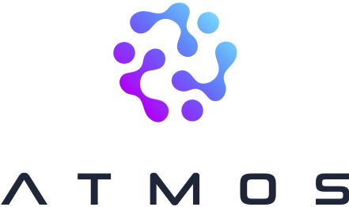

  

<h1 align="center">Atmos DK1</h1>

# Atmos Extended Reality DK 1

We are building an XR (AR/VR) headset that allows you to create XR experiences for the web. Our first headset will be made from off-the-shelf components and will be open source so others can build on top of it.

## Our headset is different
- By using existing web infrastructure you can build on our headset with standard web technologies including Javascript and HTML. No need to learn C# or C++.
- Our web development environment allows you to create experiences without leaving the comfort of your headset.
- Users can access experiences via any web enabled device. No more downloading large but limited apps.

## Where are we heading?
From now until July, we’ll be finishing our headset and releasing our developer kit. The feedback from this headset will allow us to create a consumer version that we can then sell to a wider market.

After its release you will be able to buy the kit on our website or build it yourself using our open documentation. 

### Our key next steps
- WebVR Capable Prototype
- Inside-out tracking
- Integrating hand and eye tracking
- Passthrough AR Support
- SDK Development, Documentation, and Tutorials
- Dev Kit 1 Launch

## How to get involved

The web is what XR is missing. We are looking for developers who want to take advantage of an open ecosystem and the use of simple languages. We will be allowing people to create headsets starting with the WebVR prototype. This means if you own a 3D printer and have a computer you can update the headset and order parts along with us.

If you are working on or plan to work on any projects on the web please reach out to us as we would love to collaborate with other web XR projects.

Join the conversation on Discord: [Atmos Discord](https://discord.gg/djnEvwW)

Stay up to date by following us on Twitter: [@atmosxr](https://twitter.com/atmosxr)
